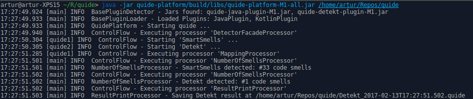

# Quide - Quality-Centric Inspection (and) Detection Environment

[](https://gitlab.com/arturbosch/quide/commits/master)



Umbrella project for static code analysis tools. 
Aims to unify the execution flow of different tools by providing injection points for detection, mapping, repository-mining and data storage.

Work in progress.


### Build

Quide uses gradle as the build tool.

Use `gradle build install fatjar shadow` to build all modules - including the executable platform jar -
and package the plugins.

- Use `gradle build` to check for compilation errors and for all tests pass
- Use `gradle shadow` to build `[platform|shell].[Version]-all.jar`, which is executable
- Use `gradle fatjar` to package the plugins with all needed dependencies
- Use `gradle install` to move all `quide` jars into your local maven, this is needed for plugin development

### Run

Quide uses `jcommander` as the argument parser.

```
Usage: quide [options]
  Options:
    --help, -h
      Prints the help message.
      Default: false
  * --input, -i
      The input project path.
    --output, -o
      The output report folder path.
    --properties, -p
      Additional properties as key=value pairs.
    --propertyPaths, -pp
      Additional property paths separated by comma's.
```

Usage:

`java -jar quide-platform-[version]-all.jar -i [input/path] [-o output/path]?`

On the first `java -jar quide-platform.jar` run, quide creates its folder structure and 
the `quide.properties` file in your home folder (`~/.quide`).

- put the plugins into the `~/quide/plugins` folder
- put the configurations for the plugins into the `~/quide/configurations` folder
- properties used by quide and additional properties (for selfmade plugins) can be placed into the `quide.properties` file
- additional property files can be referenced from the `quide.properties` file by using the 
`platform.additional.properties=my,comma,separated,paths` property or given quide at runtime with the `-p` and `-pp` parameters

Official supported quide plugins are:

- _quide-java-plugin_ - code smell detection for Java (uses [SmartSmells](https://github.com/arturbosch/SmartSmells))
- _quide-detekt-plugin_ - code smell detection for Kotlin (uses [Detekt](https://github.com/arturbosch/detekt))
- _quide-vcs-plugin_ - git repository mining for evolutionary analysis (uses [vcs-reader](https://github.com/dkandalov/vcs-reader))

### Modules

- `quide-specification` - the api, specifies how the platform and plugins should interact with each other.
- `quide-platform` - implements the platform-specification, knows how to handle plugins und provides an CLI for users
- `quide-xxx-plugin` - official supported plugins for quide
- `quide-shell` - interactive and extensible shell, allows to run __commands__ against projcts
- `codesmell-baseline-format` - xml format to note down false positives or baselines, where only new smells get displayed

### Plugins

Quide uses the ServiceLoader pattern to be expendable with plugins. 
A plugin must implement the `Plugin` interface and include a file `META-INF/services/io.gitlab.arturbosch.quide.platform.Plugin` with the 
fully qualified name of your plugin class:
```java
public interface Plugin extends Nameable {

	Detector detector();

	List<Processor> processors();

	UserData userData();
}
```

A `Detector`should implement the detection logic and return a smell container on each execution.
`Processors` can implement additional processing steps on containers like mapping, xml data creation or uploading the container to a
server application. They can be injected into different injection points (beforeAnalysis, beforeDetection, afterDetection, after Analysis)
and be prioritized. The `UserData` is a container holding the state of a plugin and additional analysis specific parameters.

### Shell

The quide-shell module provides an interactive approach to analyze source code while programming.

Commands:
- project [path/to/your/project] - specifies a project path which further commands are aware of
- run - executes the __quide-platform__ against specified _project_ path

##### Additional commands

TODO: I am planning to provide more commands to support developers on their daily work, eg. automatically applying licence
headers, formatting, providing metrics etc.

##### Write your own commands

The __quide-shell__ is highly extensible through __commands__. A command needs to implement
an interface __quide-shell__ is aware of. This interface looks like this:

```kotlin
interface Command {
	val id: String
	fun run(line: String): String
}
```

Example of a simple command written in java:

```java
import io.gitlab.arturbosch.quide.shell.Command;

public class HelloWorld implements Command {

    // quide-shell will use this method for command lookup
    public String getId() {
        return "hello";
    }
        
    // this method is invoked with the user input.minus(getId())
    public String run(String line) {
        return "Hello World!";
    }	
    
}
```

The `line` parameter is just what you entered in the shell minus the command itself.

TODO use annotations to parse __line__ into different parameters.

TODO: Support kotlin, groovy scripts and jar files with commands
